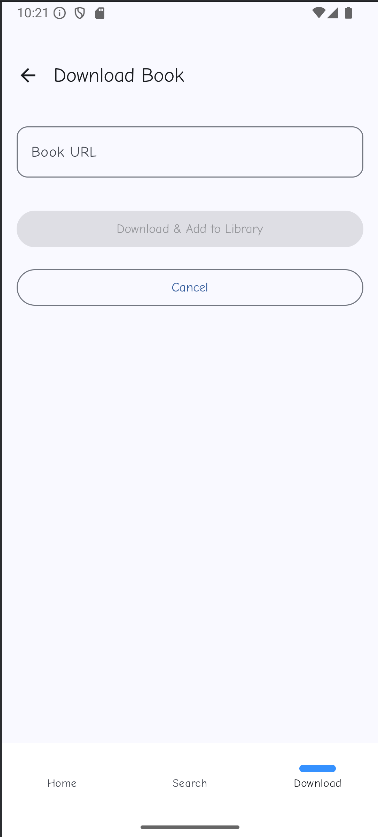
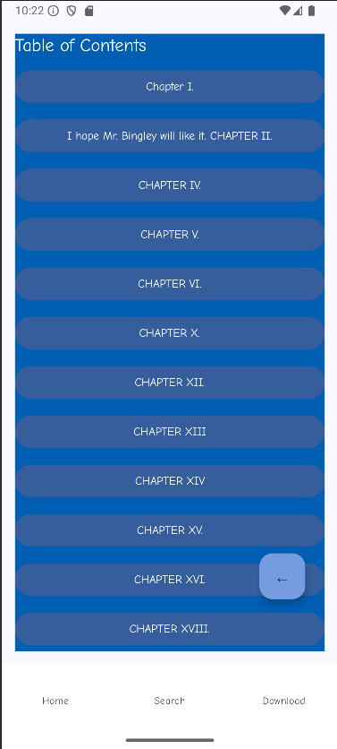
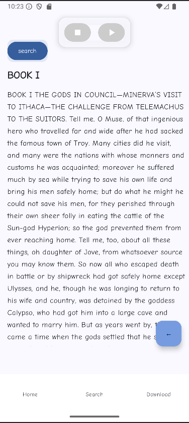
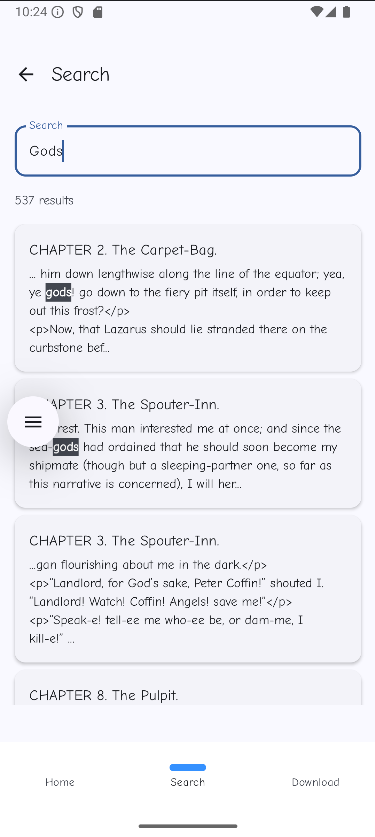

# Mobile Library

## Overview
**Mobile Library** is an Android mobile reading application built with Android Studio that allows users to read, search, and listen to books using Text-to-Speech. The app comes with three preloaded public-domain books and also allows users to download and parse their own books from external sources.

**Preloaded books:**
1. Moby Dick
2. Pride and Prejudice
3. The Odyssey

- Users have the choice of adding their own book to the reading list that will then be parsed and ready to read with the same
features as the pre-downloaded books

- When a books is selected, redirects the user to the table of content screen for the user to select a chapter from the book and begin reading from that chapter

- When reading a book, the user has the ability to allow Text-To-Speech functionality to read the book for them. Users then have the ability to pause, unpause and stop TTS from reading the book

- Search functionality is also implemented to allow the user to search for keywords within all the books and then redirects to that search area

---

## Main Features

### Home Screen

- Show the list of downloaded books (book cover page, book title, book author)
- Click a book to open it

### Download Screen to Add a Book by URL

When the user insert a URL that points to a .zip of a HTML book, the app:

1) Download the zip file using OkHttp
2) Unzip
3) Parse HTML using Ksoup and extracts:
    - book metadata
    - chapter titles
    - chapter bodies, and contents
4) Store into room database:
    - Insert a Book row
    - Insert multiple chapter rows
    - Insert a content row, the actual text that belongs to a chapter

### Book Contents Screen

- Shows the table of contents for the selected book (list of chapters)
- Clicking a chapter opens the reader screen at that chapter
- There is a back button to go back to the previous screen

### Book Reader Screen

- Shows the text of the current chapter using Jetpack Compose
- Supports vertical and horizontal scrolling
- Uses ViewModel state so the UI survives configuration changes
- TTS bar is included at the top
- Search button is included at the top left
    - When coming from Search screen, it goes to the correct chapter

### Search

- Search bar lets useer type a word or phrase
- The app searches across all saved contents in the Room database
- For each match it shows a search result with:
    - Book and chapter info
    - A short snippet of text around the match
- Clicking a result navigates to the corresponding position in the reader screen for that chapter and highlight the matched word or phrase

### TTS

- Uses Android’s TTS engine to read the book out loud
- There is a small TTS bar on the reader screen (play and pause)
- TTS works on the current chapter text.

### Navigation bar at the bottom

- Click the "Download" button to go to download screen to download a new book by parsing its URL
- Click the "Search" button to go to search screen to search word/words
- Click the "Home" button to go to home screen to see the list of downloaded books
- Click the "Table of Content" button to go to content screen to see all the contents (chapters) of a selected book

---

## Tech Stack
- **Language:** Kotlin 
- **UI:** Jetpack Compose
- **Architecture:** MVVM
- **Networking:** OkHttp
- **Parsing:** Ksoup
- **Database:** Room
- **State Management:** ViewModel

---

## Team Project
This project was developed as a team project* for a Mobile Development course.

### My Contributions
- Implemented book download workflow using OkHttp
- Parsed HTML book content and metadata using Ksoup
- Designed and implemented search functionality across all stored book contents
- Contributed to UI development using Jetpack Compose
- Worked with Room database schema and data persistence

---

## Know Bugs

Sometimes TTS wont work when you press play, seems to be a laptop to laptop issue rather than a code issue
However it is functional and works 

---

## How to run the app

1. Clone the repository
2. Open the project in Android Studio
3. Build and run on an Android emulator or physical device

---

## Authors and acknowledgment

- Sungeun Kim
- Christian Graceffa
- Dorian Castillo
- Francis Mignacca

---
