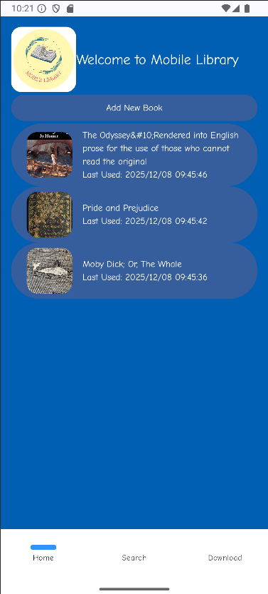

# Mobile Library

## Overview
A Android studio developped mobile reading applications that allows readers to read three pre-downloaded books:
1. Moby Dick
2. Pride and Prejudice
3. The Odyssey

Users have the choice of adding their own book to the reading list that will then be parsed and ready to read with the same
features as the pre-downloaded books

When a books is selected, redirects the user to the table of content screen for the user to select a chapter from the book and begin
reading from that chapter

When reading a book, the user has the ability to allow Text-To-Speech functionality to read the book for them.
Users then have the ability to pause, unpause and stop TTS from reading the book

Search functionality is also implemented to allow the user to search for keywords within all the books and then redirects to that search area

---

## Main Features

### Home Screen

- Show the list of downloaded books (book cover page, book title, book author)
- Click a book to open it

### Download Screen to Add a Book by URL

When the user insert a URL that points to a .zip of a HTML book, the app:

1) Download the zip file using OkHttp
2) Unzip
3) Parse HTML using Ksoup and extracts:
    - book metadata
    - chapter titles
    - chapter bodies, and contents
4) Store into room database:
   - Insert a Book row
   - Insert multiple chapter rows
   - Insert a content row, the actual text that belongs to a chapter

### Book Contents Screen
 

### Book Reader Screen

### Search

### TTS

### Navigation bar at the bottom

- Click the "Download" button to go to download screen to download a new book by parsing its URL
- Click the "Search" button to go to search screen to search word/words 
- Click the "Home" button to go to home screen to see the list of downloaded books
- Click the "Table of Content" button to go to content screen to see all the contents (chapters) of a selected book

---

## Setup Instructions

---

## Know Bugs

Sometimes TTS wont work when you press play, seems to be a laptop to laptop issue rather than a code issue
However it is functional and works 

---

## How to run the app

Clone the repo in bash: git clone https://gitlab.com/dawson-cst-cohort-2026/511/section2/Dorian-Sungeun-Francis-Christian/mobiledev_project.git

---

## Authors and acknowledgment

- Sungeun Kim
- Christian Graceffa
- Dorian Castillo
- Francis Mignacca

---

## Project status
Need to fix few issues that professor mentioned during demo

